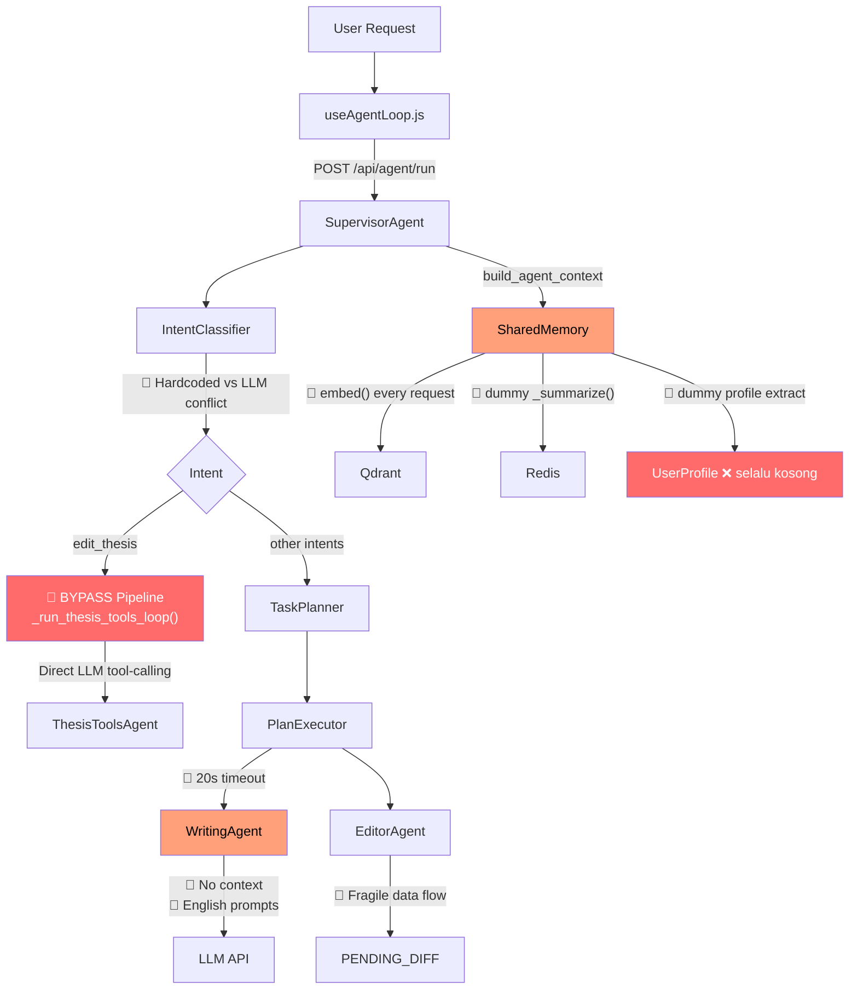

# 🔍 Diagnosis Lengkap: Writing Agent & Agent Pipeline — OnThesis AI

> **Dibuat**: 16 Maret 2026  
> **Cakupan Analisis**: 15+ file core backend & frontend agent system  
> **Metode**: Code review mendalam, trace alur end-to-end, gap analysis terhadap blueprint

---

## 1. Ringkasan Eksekutif

Fitur writing agent OnThesis memiliki **arsitektur yang cukup ambisius** (Supervisor → IntentClassifier → TaskPlanner → PlanExecutor → Agent). Namun, dari analisis kode saya menemukan **11 masalah kritis** dan **8 area yang belum optimal** yang menyebabkan agent tidak berfungsi dengan baik. Masalah utama terbagi dalam 3 kategori: **koneksi antar komponen yang putus**, **logic bugs**, dan **fitur yang baru setengah jadi (half-baked)**.

---

## 2. Bug Kritis & Masalah Fundamental

### 🐛 BUG #1: WritingAgent Prompt Selalu Bahasa Inggris — Tapi Target User Indonesia

| File | [writing_agent.py](file:///c:/Users/LENOVO/Downloads/OnThesis-AI-main/OnThesis-AI-main/app/agent/writing_agent.py) |
|---|---|

**Masalah**: Semua prompt method WritingAgent ditulis dalam **bahasa Inggris**, padahal system prompt `WRITING_AGENT_SYSTEM_PROMPT` menyatakan "Default language: Indonesian". Ini kontradiksi fatal.

```python
# Prompt SELALU Inggris:
prompt = f"Rewrite the following text in a {style} style:\n\n{text}"
prompt = f"Paraphrase the following text to avoid plagiarism..."
prompt = f"Expand the following paragraph focusing on {direction}..."
```

**Dampak**: LLM akan bingung — system prompt bilang "tulis dalam bahasa Indonesia", tapi user prompt datang dalam bahasa Inggris. Hasilnya **campuran** atau default ke Inggris, yang tidak sesuai kebutuhan mahasiswa Indonesia.

---

### 🐛 BUG #2: Writing Agent Tidak Menerima Konteks dari Editor/Memory

| File | [writing_agent.py](file:///c:/Users/LENOVO/Downloads/OnThesis-AI-main/OnThesis-AI-main/app/agent/writing_agent.py#L207-L238) |
|---|---|

**Masalah**: Method [run_tool()](file:///c:/Users/LENOVO/Downloads/OnThesis-AI-main/OnThesis-AI-main/app/agent/editor_agent.py#263-299) WritingAgent **hanya menerima raw text** sebagai input. Ia **tidak pernah membaca**:
- Konteks paragraf sebelum/sesudah (dari EditorAgent)
- Profil user (bahasa, gaya sitasi, topik tesis)
- Conversation history

```python
def run_tool(self, tool_name, input_data, params, memory=None, **kwargs):
    # memory TIDAK PERNAH DIPAKAI!
    # input_data langsung dilempar ke fungsi tanpa enrichment
    if tool_name == "generate_literature_review":
        return func(findings=input_data, **params)
    else:
        return func(text=input_data, **params)  # raw text saja
```

**Dampak**: Agent menulis tanpa konteks. Ia tidak tahu topik tesis user, tidak bisa sesuaikan gaya sitasi (APA/IEEE), dan tidak bisa mempertimbangkan paragraf sebelumnya. Seperti **penulis yang buta konteks**.

---

### 🐛 BUG #3: Data Flow Putus — "step_1" Output Tidak Cocok Jadi Input "step_2"

| File | [plan_executor.py](file:///c:/Users/LENOVO/Downloads/OnThesis-AI-main/OnThesis-AI-main/app/agent/plan_executor.py#L92-L110) |
|---|---|

**Masalah**: PlanExecutor mengekstrak output step sebelumnya dan langsung melemparnya sebagai `input_data` ke step berikutnya. Tapi **tidak ada transformasi data** antar step.

**Contoh Kasus** (intent [literature_review](file:///c:/Users/LENOVO/Downloads/OnThesis-AI-main/OnThesis-AI-main/app/agent/writing_agent.py#170-181)):
1. `step_1` → `search_papers` → output: `list[dict]` (daftar paper)
2. `step_2` → `rank_papers` → **expects**: `list[dict]` ✅ OK
3. `step_3` → `extract_findings` → **expects**: `list[dict]` dan extract key findings 
4. `step_4` → [generate_literature_review](file:///c:/Users/LENOVO/Downloads/OnThesis-AI-main/OnThesis-AI-main/app/agent/writing_agent.py#170-181) → **expects**: `list[dict]` findings
5. `step_5` → [polish_academic_tone](file:///c:/Users/LENOVO/Downloads/OnThesis-AI-main/OnThesis-AI-main/app/agent/writing_agent.py#182-194) → **expects**: [str](file:///c:/Users/LENOVO/Downloads/OnThesis-AI-main/OnThesis-AI-main/app/agent/agent_registry.py#49-86) teks ← ⚠️

Masalahnya: output dari [generate_literature_review](file:///c:/Users/LENOVO/Downloads/OnThesis-AI-main/OnThesis-AI-main/app/agent/writing_agent.py#170-181) adalah [str](file:///c:/Users/LENOVO/Downloads/OnThesis-AI-main/OnThesis-AI-main/app/agent/agent_registry.py#49-86), tapi step sebelumnya (`extract_findings`) meng-output `list[dict]`. Yang lebih kritis: **WritingAgent.generate_literature_review()** expect `findings: list[dict]`, tapi input dari `extract_findings` bisa jadi string atau format yang tidak matching.

**Dampak**: Pipeline akan **crash atau menghasilkan output nonsense** saat data mengalir antar step, karena tidak ada serializer/adapter layer.

---

### 🐛 BUG #4: Dualitas Sistem Agent — Dua Pipeline yang Saling Bentrok

| File | [supervisor.py](file:///c:/Users/LENOVO/Downloads/OnThesis-AI-main/OnThesis-AI-main/app/agent/supervisor.py#L316-L406) vs [writing_intelligence_routes.py](file:///c:/Users/LENOVO/Downloads/OnThesis-AI-main/OnThesis-AI-main/app/routes/writing_intelligence_routes.py#L288-L800) |
|---|---|

**Masalah**: Ada **DUA sistem agent yang saling duplikat**:

1. **Pipeline Blueprint** (via `SupervisorAgent.process_request()`):
   `IntentClassifier → TaskPlanner → PlanExecutor → WritingAgent/ResearchAgent`

2. **Pipeline Langsung** (via [_run_thesis_tools_loop()](file:///c:/Users/LENOVO/Downloads/OnThesis-AI-main/OnThesis-AI-main/app/agent/supervisor.py#198-307) + [writing_intelligence_routes.py](file:///c:/Users/LENOVO/Downloads/OnThesis-AI-main/OnThesis-AI-main/app/routes/writing_intelligence_routes.py)):
   `LLM tool-calling langsung → ThesisToolsAgent → Firestore`

Alur di [supervisor.py](file:///c:/Users/LENOVO/Downloads/OnThesis-AI-main/OnThesis-AI-main/app/agent/supervisor.py) line 367-373:
```python
if intent == "edit_thesis":
    # BYPASS TaskPlanner sepenuhnya!
    thesis_text = self._run_thesis_tools_loop(message, context or {}, on_event=on_event)
    return thesis_text
```

**Dampak**: Intent [edit_thesis](file:///c:/Users/LENOVO/Downloads/OnThesis-AI-main/OnThesis-AI-main/app/agent/task_planner.py#575-597) **melewati seluruh pipeline** (planner, executor, memory). Ini membuat agent tidak konsisten — kadang pakai structured plan, kadang direct LLM call. Lebih parah: [_needs_thesis_tools()](file:///c:/Users/LENOVO/Downloads/OnThesis-AI-main/OnThesis-AI-main/app/agent/supervisor.py#185-197) bisa override intent classifier, menyebabkan **routing yang unpredictable**.

---

### 🐛 BUG #5: Timeout 20 Detik Terlalu Pendek untuk LLM Chain

| File | [plan_executor.py](file:///c:/Users/LENOVO/Downloads/OnThesis-AI-main/OnThesis-AI-main/app/agent/plan_executor.py#L44) |
|---|---|

**Masalah**: `timeout_per_step = 20` detik. Tapi untuk [generate_literature_review](file:///c:/Users/LENOVO/Downloads/OnThesis-AI-main/OnThesis-AI-main/app/agent/writing_agent.py#170-181) yang melibatkan LLM call dengan `max_tokens=800` + memproses multiple paper findings, 20 detik **sering tidak cukup**, terutama saat:
- Groq rate-limited → fallback ke Gemini (menambah latency ~5-10s)
- Input findings besar (5+ papers)
- Network latency dari server Indonesia

**Dampak**: Pipeline literature review sering **timeout di step 4/5**, menghasilkan pesan error "Proses ini memakan waktu lebih lama dari biasanya" alih-alih hasil yang berguna.

---

### 🐛 BUG #6: ConversationMemory._summarize() Adalah Fungsi Mock

| File | [memory_system.py](file:///c:/Users/LENOVO/Downloads/OnThesis-AI-main/OnThesis-AI-main/app/agent/memory_system.py#L223-L225) |
|---|---|

```python
def _summarize(self, turns):
    # DUMMY! Seharusnya LLM call — tapi hanya return string statis
    return f"Dirangkum {len(turns)} pesan sebelumnya ke dalam context padat."
```

**Dampak**: Setelah 20 turn, history dikompresi menjadi string generik yang **tidak mengandung informasi apapun**. Memory jadi amnesia total setelah percakapan panjang.

---

### 🐛 BUG #7: UserProfileMemory.update_from_conversation() Tidak Mengekstrak Apapun

| File | [memory_system.py](file:///c:/Users/LENOVO/Downloads/OnThesis-AI-main/OnThesis-AI-main/app/agent/memory_system.py#L472-L477) |
|---|---|

```python
def update_from_conversation(self, user_id, message):
    # DUMMY! Tidak ada ekstraksi profil dari pesan user
    profile = self.get_or_create(user_id)
    self.db.save(profile)  # Save profil kosong
```

**Dampak**: Profil user **selalu kosong** — `thesis_topic=""`, `field=""`, dll. Semua fitur yang bergantung pada profil (personalisasi bahasa, gaya sitasi, konteks topic) **tidak berfungsi**.

---

## 3. Masalah Desain & Arsitektur

### ⚠️ ISSUE #8: WritingMode (Orchestrator) vs WritingAgent — Duplikasi yang Membingungkan

| File | [writing_mode.py](file:///c:/Users/LENOVO/Downloads/OnThesis-AI-main/OnThesis-AI-main/app/orchestrator/modes/writing_mode.py) |
|---|---|

Ada **tiga jalur** yang bisa menghasilkan writing output:
1. [writing_mode.py](file:///c:/Users/LENOVO/Downloads/OnThesis-AI-main/OnThesis-AI-main/app/orchestrator/modes/writing_mode.py) via Orchestrator → langsung LLM call (tidak pakai WritingAgent sama sekali)
2. [writing_studio.py](file:///c:/Users/LENOVO/Downloads/OnThesis-AI-main/OnThesis-AI-main/app/api/writing_studio.py) via API endpoints → `ai_utils` functions
3. [supervisor.py](file:///c:/Users/LENOVO/Downloads/OnThesis-AI-main/OnThesis-AI-main/app/agent/supervisor.py) → [TaskPlanner](file:///c:/Users/LENOVO/Downloads/OnThesis-AI-main/OnThesis-AI-main/app/agent/task_planner.py#33-661) → [PlanExecutor](file:///c:/Users/LENOVO/Downloads/OnThesis-AI-main/OnThesis-AI-main/app/agent/plan_executor.py#32-192) → [WritingAgent](file:///c:/Users/LENOVO/Downloads/OnThesis-AI-main/OnThesis-AI-main/app/agent/writing_agent.py#59-239)

**Tidak jelas kapan jalur mana yang dipanggil.** Frontend [useAgentLoop.js](file:///c:/Users/LENOVO/Downloads/OnThesis-AI-main/OnThesis-AI-main/frontend_spa/src/features/writing/hooks/useAgentLoop.js) memanggil `/api/agent/run`, tapi endpoint tersebut **di-comment out** di [writing_intelligence_routes.py](file:///c:/Users/LENOVO/Downloads/OnThesis-AI-main/OnThesis-AI-main/app/routes/writing_intelligence_routes.py) (line 755-758), yang berarti route ini mungkin di-handle di file lain. Sementara [writing_studio.py](file:///c:/Users/LENOVO/Downloads/OnThesis-AI-main/OnThesis-AI-main/app/api/writing_studio.py) punya endpoint sendiri `/chat`, `/paraphrase`, `/transform` yang **bypass agent system sepenuhnya**.

---

### ⚠️ ISSUE #9: Embed() Dipanggil di SETIAP build_agent_context() — API Cost Explosion

| File | [memory_system.py](file:///c:/Users/LENOVO/Downloads/OnThesis-AI-main/OnThesis-AI-main/app/agent/memory_system.py#L490-L500) |
|---|---|

```python
def build_agent_context(self, current_query):
    known_papers = self.research.get_papers(topic=current_query)  # embed() call!
    relevant_sections = self.document.get_relevant_context(...)    # embed() call!
```

Setiap request user memicu **minimal 2 embedding API calls** ke Gemini, bahkan untuk pesan sederhana seperti "halo" atau "terima kasih". Tidak ada caching embedding.

---

### ⚠️ ISSUE #10: Intent Classifier — Hardcoded Rules vs LLM, Tumpang Tindih

| File | [intent_classifier.py](file:///c:/Users/LENOVO/Downloads/OnThesis-AI-main/OnThesis-AI-main/app/agent/intent_classifier.py#L205-L233) |
|---|---|

Ada **15 hardcoded rules** (keyword matching) yang di-evaluate SEBELUM LLM call. Masalahnya:
- Rule hanya match **exact keyword** — "revisi paragraf ini" tidak match `rewrite_paragraph` karena kata "revisi" tidak ada di rule
- "tolong perbaiki ini" bisa masuk [edit_thesis](file:///c:/Users/LENOVO/Downloads/OnThesis-AI-main/OnThesis-AI-main/app/agent/task_planner.py#575-597) (via [_needs_thesis_tools()](file:///c:/Users/LENOVO/Downloads/OnThesis-AI-main/OnThesis-AI-main/app/agent/supervisor.py#185-197)) ATAU `rewrite_paragraph` (via LLM), tergantung apakah ada `active_paragraphs` di context
- Tidak ada overlap resolution — jika hardcoded rule dan LLM memberikan intent berbeda, hardcoded menang tanpa logging

---

### ⚠️ ISSUE #11: Editor Agent Step Tidak Mendapat Output dari Writing Agent

| File | [task_planner.py](file:///c:/Users/LENOVO/Downloads/OnThesis-AI-main/OnThesis-AI-main/app/agent/task_planner.py#L409-L431) |
|---|---|

```python
def _add_editor_replacement_step(self, steps, memory_context, last_step_id):
    # params berisi target_paragraph_id, tapi TIDAK berisi new_markdown!
    steps.append(TaskStep(
        step_id="step_replace",
        agent="editor_agent",
        tool="suggest_replace_text",
        input_from=last_step_id,  # output writing agent (string teks)
        params={
            "target_paragraph_id": target_para,
            "reason": "Perbaikan teks otomatis dari Agent."
        },
        depends_on=[last_step_id]
    ))
```

Saat [suggest_replace_text](file:///c:/Users/LENOVO/Downloads/OnThesis-AI-main/OnThesis-AI-main/app/agent/editor_agent.py#97-141) dipanggil via PlanExecutor, `input_data` = output string dari WritingAgent. Tapi [_dispatch_suggest_replace_text()](file:///c:/Users/LENOVO/Downloads/OnThesis-AI-main/OnThesis-AI-main/app/agent/editor_agent.py#313-329) di EditorAgent **memerlukan** `target_paragraph_id` dan `new_markdown` — saat input_data string, ia menggunakan `params.target_paragraph_id` dan **input_data sebagai new_markdown**. Ini **secara teknis berfungsi**, tapi sangat fragile dan tidak terdokumentasi.

---

## 4. Area yang Belum Optimal

| # | Area | Status | Impact |
|---|---|---|---|
| 1 | **Tidak ada streaming** di pipeline blueprint | WritingAgent me-return full string setelah LLM selesai — user menunggu tanpa feedback | UX buruk: blank screen 10-30 detik |
| 2 | **Tidak ada retry logic** per-step | Satu kali gagal = seluruh plan gagal | Reliability rendah |
| 3 | **Memory hanya in-process** (Qdrant `:memory:` fallback) | Jika Qdrant Cloud down, semua paper/context hilang saat restart | Data loss |
| 4 | **Redis dependency** untuk ConversationMemory | Tanpa Redis → history TIDAK tersimpan antar request | Agent amnesia |
| 5 | **Tidak ada quality scoring** pada output WritingAgent | Tidak ada mekanisme self-check apakah output sudah akademis | Output bisa low quality tanpa deteksi |
| 6 | **DummyDocumentDB** masih dipakai | UserProfile.save() → noop | Profil hilang saat restart |
| 7 | **LLM model hardcode** `groq/llama-3.1-8b-instant` untuk classifier & planner | Model 8B kurang capable untuk intent classification yang nuanced | Mis-classification sering terjadi |
| 8 | **Tidak ada rate limiting** di agent pipeline | Agent bisa spam LLM calls tanpa batasan (terutama di dynamic plan) | Bill explosion risk |

---

## 5. Saran & Kritik sebagai Programmer

### 🔴 Kritik Utama

1. **Terlalu banyak "jalur"** — Ada 3 pipeline writing yang berbeda (orchestrator, writing_studio API, agent pipeline). Ini membuat debugging nightmare dan user experience tidak konsisten. **Pilih satu arsitektur dan commit.**

2. **Blueprint terlalu ideal, implementasi setengah jadi** — Blueprint (di [onthesis-agent-blueprint.md](file:///c:/Users/LENOVO/Downloads/OnThesis-AI-main/OnThesis-AI-main/onthesis-agent-blueprint.md)) sangat bagus, tapi implementasi aktual terlalu banyak shortcut: dummy functions, hardcoded rules, mock implementations. Ini technical debt yang menumpuk.

3. **Agent "bodoh" karena tidak punya context** — Ironi terbesar: sistem memory sudah dibangun (Qdrant, Redis, SharedMemory), tapi WritingAgent **sendiri tidak pernah membacanya**. Semua context injection berhenti di level Supervisor — tidak sampai ke agent worker.

4. **Over-engineering di tempat yang salah** — Dynamic plan generation via LLM ([_try_dynamic_plan()](file:///c:/Users/LENOVO/Downloads/OnThesis-AI-main/OnThesis-AI-main/app/agent/task_planner.py#602-661)) adalah fitur canggih yang belum saatnya — masih banyak basic bugs yang lebih urgent. Sebaliknya, hal fundamental seperti profil user masih dummy.

### 🟢 Yang Sudah Bagus

1. **Arsitektur modular** — Pemisahan Intent → Plan → Execute → Output sudah benar dan scalable.
2. **Diff system** — PENDING_DIFF mechanism untuk editor editing sudah cukup elegant.
3. **Fallback LLM** — Pattern primary → fallback sudah ada di setiap agent.
4. **Error messages** yang human-friendly di PlanExecutor.
5. **Frontend SSE pipeline** ([useAgentLoop.js](file:///c:/Users/LENOVO/Downloads/OnThesis-AI-main/OnThesis-AI-main/frontend_spa/src/features/writing/hooks/useAgentLoop.js)) sudah solid dan well-structured.

---

## 6. Rencana Aksi (Powerful & Valuable)

Jika saya jadi Anda, ini prioritas perbaikan yang saya propose — diurutkan dari yang **paling high-impact dan paling cepat dikerjakan**:

### 🏆 Phase 1: Critical Fixes (1-2 hari)

| # | Aksi | File | Impact |
|---|---|---|---|
| 1 | **Inject memory context ke setiap method WritingAgent** — Ubah [_call_llm()](file:///c:/Users/LENOVO/Downloads/OnThesis-AI-main/OnThesis-AI-main/app/agent/intent_classifier.py#154-197) untuk menerima [memory_context](file:///c:/Users/LENOVO/Downloads/OnThesis-AI-main/OnThesis-AI-main/app/agent/supervisor.py#114-126) dan inject ke system prompt | [writing_agent.py](file:///c:/Users/LENOVO/Downloads/OnThesis-AI-main/OnThesis-AI-main/app/agent/writing_agent.py) | Agent jadi "sadar" konteks |
| 2 | **Perbaiki semua prompt ke bahasa Indonesia** — Sesuaikan prompt internal dengan target language user | [writing_agent.py](file:///c:/Users/LENOVO/Downloads/OnThesis-AI-main/OnThesis-AI-main/app/agent/writing_agent.py) | Output konsisten Bahasa Indonesia |
| 3 | **Implementasi real [_summarize()](file:///c:/Users/LENOVO/Downloads/OnThesis-AI-main/OnThesis-AI-main/app/agent/memory_system.py#223-226)** — Gunakan LLM call untuk merangkum conversation history | [memory_system.py](file:///c:/Users/LENOVO/Downloads/OnThesis-AI-main/OnThesis-AI-main/app/agent/memory_system.py) | Memory jangka panjang berfungsi |
| 4 | **Naikkan timeout ke 45 detik** per step, 60 detik untuk literature review | [plan_executor.py](file:///c:/Users/LENOVO/Downloads/OnThesis-AI-main/OnThesis-AI-main/app/agent/plan_executor.py) | Pipeline tidak timeout |
| 5 | **Implementasi basic profile extraction** — Regex/LLM sederhana untuk mendeteksi topik tesis dari pesan user | [memory_system.py](file:///c:/Users/LENOVO/Downloads/OnThesis-AI-main/OnThesis-AI-main/app/agent/memory_system.py) | Profil mulai terisi |

### 🥈 Phase 2: Arsitektur Cleanup (3-5 hari)

| # | Aksi | Impact |
|---|---|---|
| 6 | **Satukan pipeline** — Hapus [writing_mode.py](file:///c:/Users/LENOVO/Downloads/OnThesis-AI-main/OnThesis-AI-main/app/orchestrator/modes/writing_mode.py) & [writing_studio.py](file:///c:/Users/LENOVO/Downloads/OnThesis-AI-main/OnThesis-AI-main/app/api/writing_studio.py) writing calls, route semuanya melalui `SupervisorAgent.process_request()` | Satu pintu masuk, konsisten |
| 7 | **Buat DataAdapter layer** antar step — transformasi output step N ke format yang tepat untuk step N+1 | Pipeline tidak crash |
| 8 | **Tambah streaming ke WritingAgent** — Ubah [_call_llm()](file:///c:/Users/LENOVO/Downloads/OnThesis-AI-main/OnThesis-AI-main/app/agent/intent_classifier.py#154-197) supaya yield chunks via SSE | UX 10x lebih baik |
| 9 | **Hilangkan bypass [edit_thesis](file:///c:/Users/LENOVO/Downloads/OnThesis-AI-main/OnThesis-AI-main/app/agent/task_planner.py#575-597)** — Route [edit_thesis](file:///c:/Users/LENOVO/Downloads/OnThesis-AI-main/OnThesis-AI-main/app/agent/task_planner.py#575-597) melalui task planner juga, bukan langsung [_run_thesis_tools_loop()](file:///c:/Users/LENOVO/Downloads/OnThesis-AI-main/OnThesis-AI-main/app/agent/supervisor.py#198-307) | Semua intent konsisten |

### 🥉 Phase 3: Intelligence Upgrade (1-2 minggu)

| # | Aksi | Impact |
|---|---|---|
| 10 | **Upgrade classifier model** — Gunakan model 70B (bukan 8B) untuk intent classification, atau fine-tune | Akurasi intent naik drastis |
| 11 | **Self-evaluation loop** — Setelah WritingAgent generate output, jalankan AnalysisAgent untuk scoring → jika score < threshold, re-generate | Output quality terjamin |
| 12 | **Embedding cache** — Cache hasil embedding per query string (TTL 1 jam) | API cost turun 60-80% |
| 13 | **Multi-turn agent conversation** — Supervisor bisa iterasi dengan WritingAgent (bukan one-shot) | Output lebih natural |
| 14 | **Citation-aware writing** — WritingAgent menerima list referensi dari ResearchMemory dan menyisipkannya secara akurat | Literature review jadi academic-grade |

---

## 7. Diagram Masalah



---

## 8. Kesimpulan

WritingAgent OnThesis memiliki **fondasi arsitektur yang solid** (terutama blueprint-nya), tapi **implementasi aktual masih ~40% dari blueprint**. Masalah terbesar bukan di design, melainkan di **eksekusi detail**: dummy functions, data flow yang tidak ter-test, dan terlalu banyak jalur alternatif yang saling bentrok.

**Rekomendasi #1**: Jangan tambah fitur baru dulu. **Perbaiki yang sudah ada** — context injection, profil extraction, dan penyatuan pipeline. Setelah fondasi kokoh, fitur-fitur canggih (self-evaluation, multi-turn, citation-aware writing) akan jauh lebih mudah dibangun.
